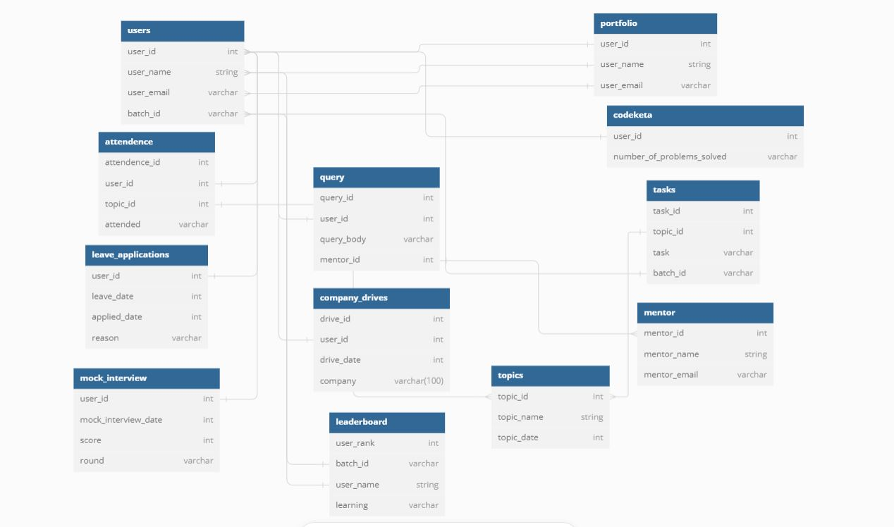
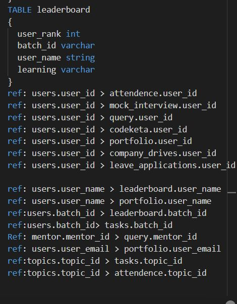

## 📊 mysql_day2-task(DB DIAGRAM FOR GUVI ZEN CLASS USING MYSQL .)

Student Management Database Schema – A relational database design to manage students, learning activities, mentors, attendance, queries, coding practice, company drives, and more.

---

## 🚀 Features

- 👤 Manage student details & batches

- 📚 Track topics, tasks, and assignments

- 📝 Maintain attendance records

- ❓ Handle student queries with mentor mapping

- 💻 Record coding practice performance

- 🧑‍🏫 Assign and manage mentors

- 🏆 Leaderboard rankings for students

- 🏢 Manage company placement drives

- 🎤 Store mock interview details

- 📂 Maintain student portfolios

- 🏖 Track leave applications

  ---

## 🏗 Project Structure
mysql_day2-task/
├── index.html
├── mysql-2.JPG
├── mysql-3.JPG
├── mysql-4.JPG
├── mysql_4.JPG
├── mysql_day_2 task.JPG


---

## 📥 Clone
```bash
git clone https://github.com/Elanthiran/mysql_day2-task.git
cd mysql-day2-task

```

---

## ⚙️ Usage

1. Import the SQL schema into your MySQL/PostgreSQL database.

2. Run queries to manage and track student data.

3. Use relationships (foreign keys) to fetch reports (attendance %, top students, etc.).

---

## 📸 Screenshots

ER Diagram of the Database :



MYSQL Table Definitions :



---

🛠 Tech Stack

- Database: MySQL
  

- Schema Design: ER Diagram

  

---

🔮 Future Improvements

- Add stored procedures for reports

- Implement triggers for auto leaderboard updates

- Build a frontend dashboard to visualize data

---

🤝 Contributing

Contributions are welcome!

- Fork this repo

- Create a new branch (feature-xyz)

- Commit your changes

- Open a Pull Request

---

## 📜 License

This project is licensed under the MIT License.
